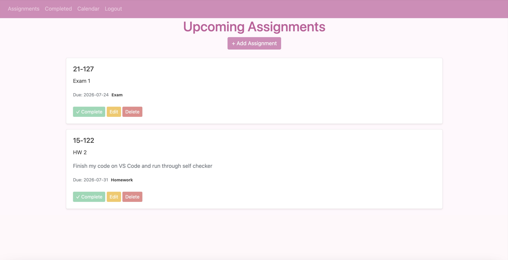
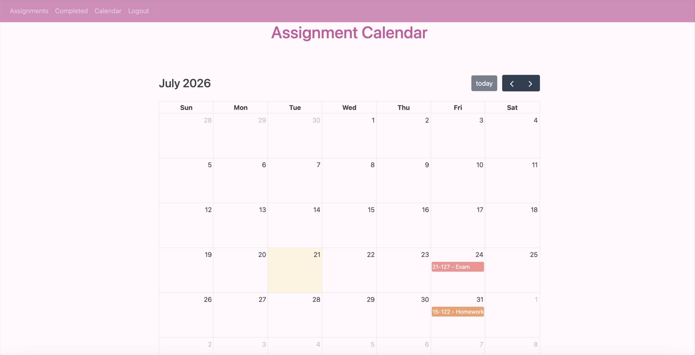
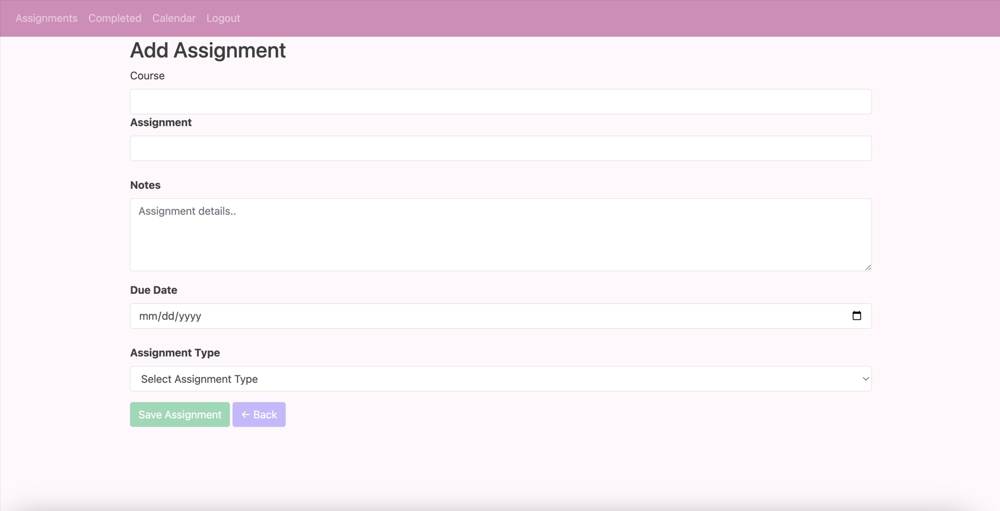
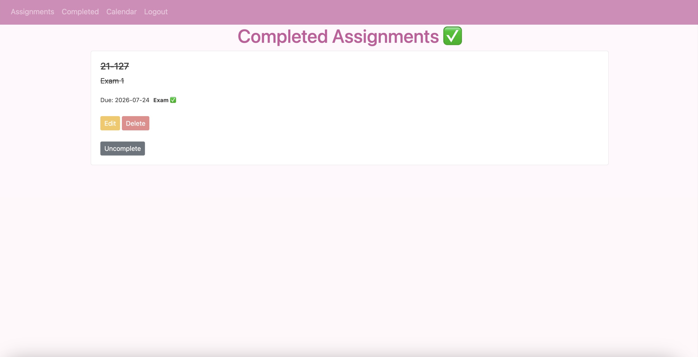

# Student Assignment Tracker

A web application I built to help students keep track of assignments, deadlines, and coursework in one place. As a college student, I wanted an easier way to organize upcoming work, monitor completed assignments, and view deadlines on a calendar.

## Features
- Create, edit, and delete assignments
- Organize assignments by category (Homework, Classwork, Quiz, Exam)
- Mark assignments as completed
- Add notes to assignments
- View upcoming assignments sorted by due date
- Calendar view with color-coded assignment categories
- User accounts and authentication so each student sees only their own assignments

## Built With
Python
Flask
SQLAlchemy
SQLite
HTML/CSS
Bootstrap
FullCalenda

##Why I Built This
I created this project to gain experience with full-stack web development while building something I could actually use as a student. Through this project, I learned how to work with databases, user authentication, CRUD operations, templates, and dynamic calendar integrations.

## Screenshots

## Home Page

### Calendar View

### Add Assignment

### Completed Assignments

